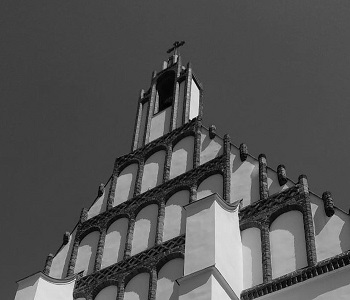
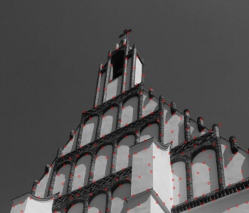

# Harris Detector

This project is my implementation of Harris Corner Point Detector proposed by Chriss Harris & Mike Stephens [[1]](http://www.bmva.org/bmvc/1988/avc-88-023.pdf). It was originally implemented as part of my bachelor's thesis but I reused it in several projects and improved the performance of my previous algorithm significantly.

Note that this isn't meant as ready-to-use implementation but more as a demo showing how to implement it.

This project uses NumPy, SciPy and OpenCV.